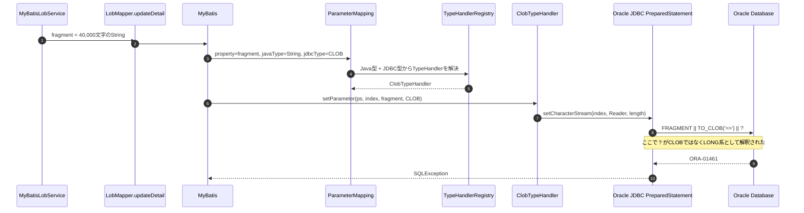
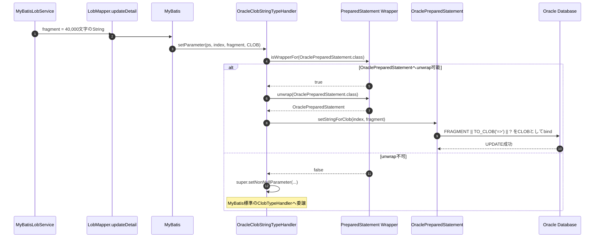

# MyBatis CLOBバインド問題の整理

## 概要

今回の問題は、MyBatisで `jdbcType=CLOB` を指定していたにもかかわらず、Oracle JDBC側でバインド変数がCLOBではなくLONG系として解釈され、CLOB連結のUPDATEでエラーになったものです。

問題が発生したSQL断片は `LobMapper.xml` の `updateDetail` です。

```xml
FRAGMENT = FRAGMENT || TO_CLOB('=>') ||
    #{fragment,jdbcType=CLOB}
```

更新時の `fragment` は `MyBatisLobService` で40,000文字の文字列として生成されます。この値を上記のCLOB連結式に渡した際、Oracleから以下の系統のエラーが返りました。

```text
ORA-01461: LONG値はLONG列にのみバインドできます
```

期待した状態は「`fragment` をCLOBとしてバインドする」ことでした。しかし、MyBatis標準のCLOB向けTypeHandlerが使用するJDBC APIとOracle JDBCの型解釈の組み合わせにより、実際にはLONG系として扱われました。

## 関係する実装

対象箇所は以下です。

- `src/main/resources/mapper/LobMapper.xml`
- `src/main/java/com/example/dbperf/service/MyBatisLobService.java`
- `src/main/java/com/example/dbperf/typehandler/OracleClobStringTypeHandler.java`
- `src/main/resources/application.properties`

現在の対応では、問題が発生した `updateDetail` の `fragment` にだけ独自TypeHandlerを局所適用しています。

```xml
#{fragment,jdbcType=CLOB,typeHandler=com.example.dbperf.typehandler.OracleClobStringTypeHandler}
```

## MyBatisがパラメータを解釈する順番

MyBatisでは、Mapper XMLの `#{...}` がそのままJDBCに渡されるわけではありません。実行前に `ParameterMapping` として解析され、実行時に `TypeHandler` を経由して `PreparedStatement` に値が設定されます。

大まかな順番は次の通りです。

1. Mapper XMLの `#{fragment,jdbcType=CLOB}` を解析する。
2. `fragment` のJava型を確認する。今回のJava型は `String`。
3. XMLで指定されたJDBC型を確認する。今回のJDBC型は `CLOB`。
4. `typeHandler` が明示指定されていなければ、Java型とJDBC型から標準TypeHandlerを選択する。
5. `String` + `JdbcType.CLOB` の組み合わせでは、標準の `ClobTypeHandler` が使用される。
6. 実行時に `DefaultParameterHandler` がSQL上の `?` の順番にパラメータを処理する。
7. 各パラメータについて、選択済みのTypeHandlerが `PreparedStatement` に値を設定する。
8. 最終的なバインド型は、呼び出されたJDBC APIをもとにJDBCドライバが解釈する。

重要なのは、`jdbcType=CLOB` を指定した時点でOracleにCLOBとして渡ることが保証されるわけではない、という点です。MyBatisはその指定をもとにTypeHandlerを選択しますが、実際にどのJDBC APIで値を設定するかはTypeHandlerの実装に依存します。

## 修正前のシーケンス

修正前は、`String` + `jdbcType=CLOB` に対してMyBatis標準の `ClobTypeHandler` が使われていました。この標準ハンドラは `PreparedStatement#setCharacterStream` を使用します。



この時点でMyBatisは `jdbcType=CLOB` を認識しています。にもかかわらずエラーになった理由は、標準 `ClobTypeHandler` の実装がCLOB専用のOracle APIではなく、汎用的な `setCharacterStream` を使うためです。

`setCharacterStream` は文字ストリームを渡すJDBC標準APIですが、Oracle JDBCではSQL式や値の長さによってLONG系として扱われるケースがあります。今回のCLOB連結式では、`FRAGMENT || TO_CLOB('=>') || ?` の `?` がCLOBとして確定せず、LONG系として解釈されたことがエラーの直接原因です。

## 発生箇所の整理

型解釈のズレは、MyBatisの `ParameterMapping` 作成時ではなく、TypeHandlerがJDBCドライバへ値を渡す段階で発生しました。

| 段階 | 状態 | 問題の有無 |
| --- | --- | --- |
| Mapper XML解析 | `jdbcType=CLOB` は認識されている | 問題なし |
| TypeHandler選択 | `String` + `CLOB` から `ClobTypeHandler` を選択 | MyBatis標準動作としては妥当 |
| TypeHandler実行 | `setCharacterStream` で値を設定 | OracleではLONG系解釈の余地がある |
| Oracle実行 | CLOB連結式の `?` がLONG系として扱われる | ここでORA-01461 |

したがって、「MyBatisがCLOB指定を無視した」というより、「CLOB指定により標準CLOBハンドラは選ばれたが、その標準ハンドラのJDBC API選択がOracleの今回のSQLには合わなかった」と整理できます。

## 最終的な解決方法

最終対応では、Oracle JDBCの場合だけ `OraclePreparedStatement#setStringForClob` を使用する独自TypeHandlerを追加しました。

```java
@MappedTypes(String.class)
@MappedJdbcTypes(JdbcType.CLOB)
public class OracleClobStringTypeHandler extends ClobTypeHandler {

    @Override
    public void setNonNullParameter(PreparedStatement ps, int i, String parameter, JdbcType jdbcType)
            throws SQLException {
        if (ps.isWrapperFor(OraclePreparedStatement.class)) {
            ps.unwrap(OraclePreparedStatement.class).setStringForClob(i, parameter);
            return;
        }

        super.setNonNullParameter(ps, i, parameter, jdbcType);
    }
}
```

この実装の意図は次の通りです。

- `ClobTypeHandler` を継承し、読み取り処理やOracle JDBC以外の標準処理は既存実装に任せる。
- 書き込み時の `setNonNullParameter` だけを差し替える。
- Oracle JDBCとしてunwrapできる場合は、OracleのCLOB専用APIである `setStringForClob` を使う。
- Oracle JDBCとしてunwrapできない場合は、標準の `ClobTypeHandler` に委譲する。

## 修正後のシーケンス

修正後は、問題が発生した `updateDetail` の `fragment` に独自TypeHandlerを明示指定しています。



この対応により、Oracle JDBCでは `?` がCLOBとしてバインドされ、CLOB連結式でLONG系として誤解釈されることを避けられます。

## 局所適用にした理由

今回問題が確認されたのは、CLOB列への通常INSERTや単純UPDATEではなく、CLOB連結式を含む `updateDetail` でした。そのため、まずは影響範囲を絞るためにMapper XMLで局所的にTypeHandlerを指定しています。

```xml
#{fragment,jdbcType=CLOB,typeHandler=com.example.dbperf.typehandler.OracleClobStringTypeHandler}
```

`@MappedTypes(String.class)` と `@MappedJdbcTypes(JdbcType.CLOB)` は、TypeHandlerをパッケージスキャンなどで登録する場合に、どのJava型・JDBC型に対応するハンドラかをMyBatisへ伝えるためのメタ情報です。現在のようにMapper XMLで `typeHandler` を明示指定している場合、動作上はこの明示指定が優先されます。

全体適用したい場合は、`application.properties` のコメントに残している通り、TypeHandlerパッケージを登録する方法があります。

```properties
# mybatis.type-handlers-package=com.example.dbperf.typehandler
```

ただし、`String` + `CLOB` の全箇所に影響するため、今回の対応では局所適用を継続しています。

## TypeHandlerを全て一から自作しなかった理由

今回差し替えたかった処理は、CLOB値を書き込むときのバインド方法だけです。具体的には、MyBatis標準の `ClobTypeHandler` が `setCharacterStream` を呼ぶ部分を、Oracle JDBCの場合だけ `OraclePreparedStatement#setStringForClob` に置き換えたい、という限定的な要件でした。

そのため、TypeHandler全体を `BaseTypeHandler` から一から実装するのではなく、既存の `ClobTypeHandler` を継承し、`setNonNullParameter` だけをoverrideしています。

この方針にした理由は次の通りです。

- MyBatis標準のCLOB処理をできるだけ再利用できる。
- 読み取り処理など、今回の問題と関係しない処理を独自実装しなくてよい。
- Oracle JDBCとして扱える場合だけ、問題の原因になった書き込みAPIを差し替えられる。
- Oracle JDBCとしてunwrapできない場合は、標準の `ClobTypeHandler` に委譲できる。
- 独自実装範囲を小さくできるため、MyBatis標準実装との差分が明確になる。

つまり、このTypeHandlerは「CLOB処理を全面的に作り直すためのクラス」ではなく、「標準 `ClobTypeHandler` のうち、Oracleで問題になったバインド処理だけを差し替えるためのクラス」です。

## Reader型へ変更しなかった理由

MyBatisには `Reader` をCLOBとして扱うための `ClobReaderTypeHandler` もあります。しかし、その場合はDTOやモデルの `fragment` を `String` ではなく `Reader` として扱う必要が出ます。

実装イメージは次のようになります。

```java
public class LobDetail {

    private Long id;
    private Long headerId;
    private Long no;
    private Reader fragment;
    private Long fragmentLen;
    private String memo;
}
```

サービス層では、文字列から `StringReader` を作成してDTOへ設定します。

```java
String updatedDetailText = createSampleText("UPDATE_SAMPLE:", 40000);

LobDetail detail = new LobDetail();
detail.setId(insertResult.getDetailId());
detail.setNo(1L);
detail.setFragment(new StringReader(updatedDetailText));
detail.setFragmentLen((long) updatedDetailText.length());
detail.setMemo("MyBatis updated sample data");
```

Mapper XMLでは、`fragment` の型を `Reader` として扱わせます。プロパティ型が `Reader` であれば推論可能ですが、意図を明確にするなら `javaType` を明示します。

```xml
#{fragment,jdbcType=CLOB,javaType=java.io.Reader}
```

この場合、MyBatisは `Reader` 用のCLOBハンドラである `ClobReaderTypeHandler` を利用する経路になります。

ただし、`Reader` は値そのものではなく、値を読み出すためのストリームです。ストリームは基本的に現在位置を持つため、一度読み進めると同じインスタンスをそのまま再利用できません。再度同じ内容を読みたい場合は、新しい `StringReader` を作り直す、またはストリームをリセット可能にして明示的に戻す、といった管理が必要になります。

そのため、`Reader` をDTOのフィールドにすると、DTOが「値の入れ物」として扱いにくくなります。ログ出力、テストでの値比較、レスポンス検証、同じ値を複数回使う処理では、`String` のように中身を直接保持している型のほうが扱いやすいです。

今回のアプリでは、`fragment` はサービス層・テスト・レスポンス確認で文字列として扱うほうが自然です。問題はJava側の表現型ではなく、Oracle JDBCへのバインドAPI選択にありました。そのため、モデルを `Reader` に寄せるのではなく、`String` のままOracle向けTypeHandlerでバインド方法だけを変更しました。

## 検証結果

Oracle起動済みの環境で以下のテストが成功することを確認しています。

```powershell
.\mvnw -Dtest=MyBatisLobControllerTest test
```

確認結果は以下です。

```text
Tests run: 2, Failures: 0, Errors: 0
```

## まとめ

今回の問題は、Mapper XML上の `jdbcType=CLOB` 指定が不足していた問題ではありません。MyBatisはCLOB指定を認識し、標準の `ClobTypeHandler` を選択していました。

しかし、標準 `ClobTypeHandler` は `setCharacterStream` を使うため、Oracle JDBCではCLOB連結式のバインド変数がLONG系として解釈されるケースがありました。そこでOracle JDBCの場合だけ `setStringForClob` を使う独自TypeHandlerを追加し、問題のSQLパラメータに局所適用しました。

最終的な整理は次の通りです。

- MyBatis上の型指定: `String` + `jdbcType=CLOB`
- 修正前のTypeHandler: `ClobTypeHandler`
- 修正前のJDBC API: `setCharacterStream`
- Oracle側の誤解釈: CLOBではなくLONG系としてbind
- 発生エラー: `ORA-01461`
- 修正後のTypeHandler: `OracleClobStringTypeHandler`
- 修正後のOracle向けJDBC API: `OraclePreparedStatement#setStringForClob`
- 適用範囲: `LobMapper.xml` の `updateDetail.fragment` に局所適用
